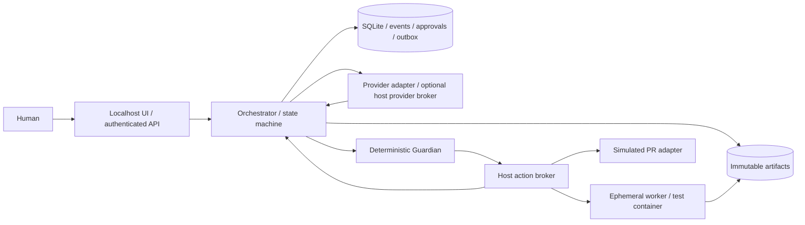

# Architecture proposal

Status: proposed, 2026-09-12. Implement incrementally after review of this baseline.

## Decisions and boundaries

Use Python 3.12, a small HTTP service (FastAPI proposed), SQLite on a local Linux
volume, and a filesystem artifact store. Use JSON Schema at all trust boundaries;
derive application types or validate typed models against the committed schemas.
Use server-rendered pages and server-sent events for the initial UI. No message
broker, vector database, agent framework, Redis, or Kubernetes is needed for one task.



| Component | Authority and responsibility |
| --- | --- |
| Orchestrator | Owns state, role assignment, bounded context, leases, approval binding, transactional events and dispatch. Never executes model-produced shell text. |
| Provider adapter | Converts one structured invocation into a versioned prompt and parses a bounded result. No workflow mutation or approval authority. |
| Guardian | Evaluates authenticated principal, operation, approved scope, paths, argument grammar, quotas and policy version; defaults to deny. |
| Host action broker | Sole Docker authority; launches preapproved immutable images and fixed tool recipes. Owns trusted command/test/patch receipts. Separate OS identity; narrowly authenticated local API. |
| Worker | One task workspace, no credentials, no state DB, no Docker socket, no peer channels. Cannot approve, push, publish, or write receipts as authoritative evidence. |
| Test runner | Fresh container against frozen patch snapshot, approved test recipe from trusted base/config; produces receipts even on failure. |
| Artifact service | Content-addressed bytes, task ACLs, hashes, provenance, redaction status, quotas, retention and export. No arbitrary path or URL resolution. |
| UI/API | Reads durable projections; authenticated human approval endpoints; safe rendering of untrusted output. UI refresh cannot trigger execution. |
| External adapter | Simulates PR first; later holds narrowly scoped GitHub/Jira authorization outside workers and records reconciliation identifiers. |

The host broker is privileged trusted computing base. A compromised broker or host
administrator can defeat container isolation and local audit integrity. Minimize its
API; do not expose generic container configuration, arbitrary mounts, or host exec.

## Roles and minimum context

| Role/invocation | Inputs | Output / permitted authority |
| --- | --- | --- |
| Project manager | User request and project/workflow metadata | TaskSpec proposal; later brokered Issue/Jira requests; no source writes |
| Lead: clarification | Request, project metadata, unresolved questions | ClarificationRequest; separate invocation from planning |
| Lead: planning | Human-confirmed specification and selected repository/architecture artifacts | ImplementationPlan proposal; no source writes |
| Junior: implementation | Approved spec/plan, WorkOrder, selected task repository artifacts | Candidate patch and ToolRequests; no approval authority |
| Reviewer | Approved spec/plan, frozen diff and trusted deterministic test receipts | ACCEPT / REJECT / NEEDS_CHANGES; no implementer conversation or source writes |
| Guardian | Structured action, identity, authoritative scope and policy | Deterministic ToolDecision |

Each invocation has a different identity and manifest even when the same provider/model
serves multiple roles. Reviewer invocation must differ from implementer invocation;
roles are enforced by the orchestrator, not role names supplied by the model. Prompts,
adapter versions, model selection, artifact hashes and context manifest are retained.
Repository/Issue/Jira/document/tool text is untrusted data with explicit provenance;
it never becomes system instructions. No entire chat history is passed between steps.

## Provider boundary

Initial configuration keys are `github_copilot_cli` and
`abc_binary_ai_placeholder`. Executable path, argv template, model, adapter version,
prompt version, timeout, output limit and delivery mode are operator configuration.
Never guess the corporate executable name. Example corporate argv template:
`["-p", "{prompt}"]`, substituted as a single argument without a shell. Prefer stdin
when a verified CLI version supports it. Never put credentials in prompts or argv.

Adapters advertise structured-output, cancellation, token-usage and tool-disable
capabilities, and perform bounded health/auth checks. Unsupported required capability
blocks the invocation. Invalid JSON/schema, timeout or nonzero exit is an error, not
a successful result inferred from prose. Token/model/cost fields may be null.

For the first slice use **proposal-only model calls**: the model proposes an edit;
the broker applies it inside the Junior worker container. Native provider tools must
be disabled and tested as disabled. If a CLI cannot reliably prevent built-in tool
execution, do not run it on the host or admit it to this slice. A corporate SSO host
provider broker is conditional on that capability; it is not a general host shell.
Later native agent execution requires demonstrably complete interception plus OS
containment. Prompt-level requests to avoid tools are insufficient.

GitHub AI authentication and repository authorization are separate capabilities.
Only the provider broker may access its specific authentication material. Never mount
a home directory or complete credential store into a worker. Scoped secret files may
be used by trusted brokers where corporate policy permits; objects carry references.

## Persistence and portability

Proposed tables: tasks (versioned projection), events (unique task/sequence), artifacts,
invocations, tool_operations, policy_decisions, approvals, test_receipts,
review_decisions, external_actions, outbox, and leases. Immutable records contain
validated JSON payloads plus indexed task/operation IDs. Foreign keys bind evidence
to the same task and revision. UNIQUE constraints enforce idempotency and one active
approval decision per request. SQLite WAL, foreign keys, transactions and migrations
are mandatory. Keep the DB on a Docker/WSL Linux volume, not an SMB share. Back up
the DB and referenced artifacts consistently; verify restores and replay.

State update, TaskEvent insert, and outbox intent commit in one transaction with
expected revision checking. A single dispatcher polls outbox; delivery is at-least-once.
Task advancement itself is no longer store-wide: see [task ownership](task-ownership.md)
for the per-task lock and the recorded claim that replaced the single dispatcher lock.
Broker operation IDs and reconciliation prevent duplicate effects (see workflow).
Events cannot be updated/deleted through application APIs; database triggers protect
against accidental modification. Local administrators can still rewrite SQLite;
off-host signed exports are a later tamper-evidence enhancement, not an MVP claim.

Artifact bytes are staged, redacted where necessary, hashed and atomically finalized
before references are committed. Hash the retained bytes; preserve a manifest of
redaction without storing original secrets. Reject missing/hash-mismatched evidence.
Garbage-collect unreferenced staged bytes after a grace period. Size/output/time quotas
apply before ingestion; record truncation explicitly. Retention is operator policy.

Linux containers run via Docker Desktop from PowerShell 7 or WSL. Broker runtime is
replaceable behind an interface; task contracts contain workspace IDs/relative paths,
not Windows host paths. Docker authority stays on the trusted host. Later replace
SQLite with PostgreSQL and dispatch transport with a broker without changing events
or guards. Kubernetes scheduling is a later executor, not a workflow redesign.

## Container execution profile

Fresh clone/worktree at an approved base commit per attempt; never the operator checkout.
Non-root UID, read-only root, explicit workspace mount and bounded tmpfs; all Linux
capabilities dropped, no-new-privileges, default seccomp, no privileged mode/devices/
host namespaces, no socket/home/credential mounts. Initial proposed limits: 1 CPU,
1 GiB memory, 128 PIDs, 10 minute deadline, 10 MiB output per stream and 100 MiB patch
budget (tighten patch budget per WorkOrder). Network disabled for workers/tests.
Dependency retrieval happens separately with an approved allowlisted broker and
digest-pinned inputs; no package downloads during execution. Reject symlinks escaping
the workspace, special files, submodule changes and unexpected Git hooks. Copy worktree
metadata safely: linked worktrees must not expose the operator's shared `.git` directory.

Freeze output, stop/reap the process tree, collect broker-computed diff and hashes,
persist receipts, then delete the worker. Recheck paths at use; allowlist application
is no substitute for isolation. Read-only reviewer/test input prevents post-test edits.

## Local management UI

Bind to loopback only. Require an operator session, CSRF protection, strict Origin/Host
checks and no permissive CORS; localhost is not authentication. Agents never receive
the session. Approval cards display exact plan/action hash, diff, scope, tests,
expiry and consequences with explicit approve/reject. No blanket approvals.

Task detail shows state, role, container/lease, provider/model, spec, plan, changed
files/diff, tests/output, review findings, Guardian decisions, pending approvals,
GitHub/Jira refs, errors and durations. Timeline entries include task, sequence,
origin role, provider/model, event type, timestamp and artifact links. SSE resumes
from persisted sequence IDs. Escape all text and sanitize links; no executable HTML
from artifacts. Large artifacts are streamed through task authorization checks.

## Proposed repository layout

```text
contracts/v1/             JSON schemas and examples (this revision)
contracts/interfaces.py  typed interface proposal (this revision)
docs/                    architecture, workflow, security, milestones
scripts/                 contract validation (this revision)
src/orch/domain/          future state machine and typed contracts
src/orch/persistence/     future migrations, event store, outbox
src/orch/providers/       future versioned CLI adapters
src/orch/context/         future role manifests and prompt templates
src/orch/guardian/        future policy and ACS adapter boundary
src/orch/brokers/         future action, credential, Docker and test brokers
src/orch/web/             future localhost API, templates and SSE
tests/                   future unit, integration, adversarial and recovery tests
deploy/                  future Dockerfiles/Compose and operator configuration
```
